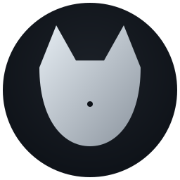

<div align="center">
  
  <h1>MurNet</h1>
  <p>Decentralized P2P network with onion routing, DHT, and VPN tunneling</p>

  [](https://opensource.org/licenses/MIT)
  [](https://www.python.org/downloads/)
  [](docs/en/ARCHITECTURE.md)
  <br>
  <a href="README_RU.md">🇷🇺 Русская версия</a>
</div>

---

**MurNet** is an experimental decentralized P2P network featuring onion routing, Kademlia DHT, and VPN/SOCKS5 tunneling.

Nodes connect directly without central servers. Traffic is protected via multi-layered encryption (X25519 + AES-256-GCM). The architecture follows **security by design** principles.

> ⚠️ **Educational Prototype.** This project has NOT undergone a cryptographic audit. Do not use it for traffic requiring real anonymity or high-stakes security.

---

## Why MurNet?

MurNet was created as a playground for learning modern P2P technologies. Key goals include:
1.  **Transparency:** A "from scratch" implementation of onion routing (pure Python + asyncio) so anyone can understand how circuits are built and keys are exchanged.
2.  **Decentralization:** Leveraging Kademlia DHT for peer discovery without any central points of failure (no Directory Authorities).
3.  **Modern Stack:** Using modern primitives (Ed25519, X25519, Argon2id) instead of legacy RSA/SHA-1.

## Gallery

| Component | Description |
|---|---|
| **Onion Chat (TUI)** | Interactive terminal chat visualizing cell transit through network nodes. |
| **Network Visualizer** | Live network map using Force-Directed Layout (tkinter) — shows connections and RTT. |
| **Desktop App** | GUI client for local node management and traffic monitoring. |

*(Screenshots are available in the `assets/screenshots/` folder)*

---

## Features

| Component | Description |
|---|---|
| **Onion routing** | 3-hop circuits, X25519 ECDH + AES-256-GCM |
| **Relay discovery** | Gossip announcements — relay nodes find each other automatically |
| **DHT** | Kademlia with HMAC authentication |
| **VPN / SOCKS5** | TCP traffic tunneling through onion chains |
| **Identity** | Ed25519 keys, Base58 addresses, Blake2b NodeIDs |
| **REST API** | FastAPI-powered node control |
| **TUI Chat** | Textual-based anonymous chat interface |

---

## Installation

```bash
pip install murnet                    # from PyPI (stable)
pip install -e .                      # from source (dev)
pip install -e ".[tui,dev]"           # with extras
```

Optional extras:

| Extra | Purpose |
|---|---|
| `tui` | Textual TUI for `murnet-node` chat mode |
| `browser` | PyQt6 for the onion browser |
| `build` | PyInstaller for EXE builds |
| `dev` | pytest, pytest-asyncio, pytest-cov |

Python 3.11+ is required.

---

## Quick Start

After installation, the following commands are available:

| Command | Action |
|---|---|
| `murnet` | Full node CLI |
| `murnet-node` | Relay node or chat participant |
| `murnet-vpn` | VPN/SOCKS5 client |
| `murnet-desktop` | Desktop GUI |

### Onion Chat (5 terminals, localhost)

```bash
# Start 3 relay nodes, each announcing itself via gossip
murnet-node --bind 127.0.0.1:9001 --name Guard  --announce
murnet-node --bind 127.0.0.1:9002 --name Middle --announce
murnet-node --bind 127.0.0.1:9003 --name Exit   --announce

# Bob — builds circuit: Exit → Middle → Alice
murnet-node --bind 127.0.0.1:9004 --name Bob \
    --peer Exit=127.0.0.1:9003 --peer Middle=127.0.0.1:9002 \
    --peer Alice=127.0.0.1:9000 --circuit Exit,Middle,Alice

# Alice — auto-discovery, only knows Guard
murnet-node --bind 127.0.0.1:9000 --name Alice \
    --peer Guard=127.0.0.1:9001 --circuit auto
```

---

## Programmatic API

```python
from murnet import MurnetNode, Identity, MurnetConfig

# Generate node identity (Ed25519)
identity = Identity.generate()
print(identity.node_id)        # Blake2b NodeID
print(identity.address)        # Base58 Address

# Start the node
config = MurnetConfig(port=8888, data_dir="./data")
node = MurnetNode(identity, config)
await node.start()
```

---

## Architecture (Briefly)

```
Alice  →  Guard  →  Middle  →  Bob
         sees         sees         sees
         Alice        Guard        Middle
         Guard        Middle       (decrypted data)
```

Each hop receives an independent session key via X25519 ECDH + HKDF-SHA256. Compromising one hop does not reveal the entire chain.

Details: [docs/en/ONION.md](docs/en/ONION.md), [docs/en/ARCHITECTURE.md](docs/en/ARCHITECTURE.md).

---

## Security

This is an **educational** project:
- No cryptographic audit has been performed.
- Anonymity is only effective with a large number of independent relay nodes.
- In the default local config (3 nodes on one machine), there is virtually no anonymity; the routing is purely decorative.

Do not use for high-risk communication. Use [Tor](https://www.torproject.org/), [I2P](https://geti2p.net/), or [Briar](https://briarproject.org/) instead.

---

## License
MIT — see [LICENSE](LICENSE).
